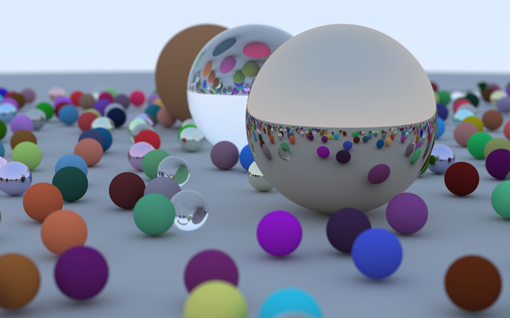
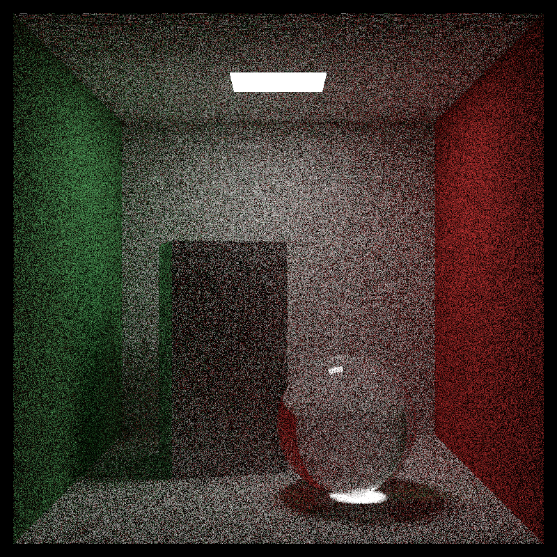
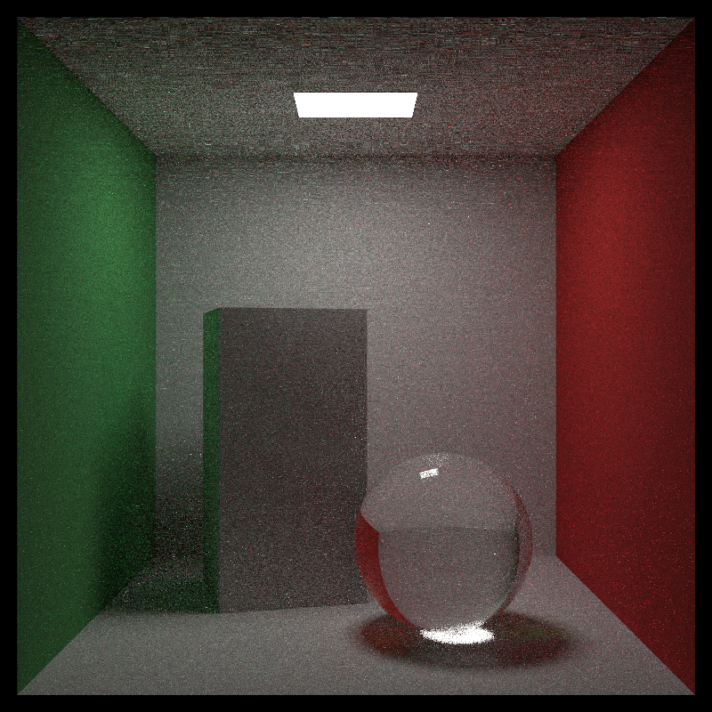
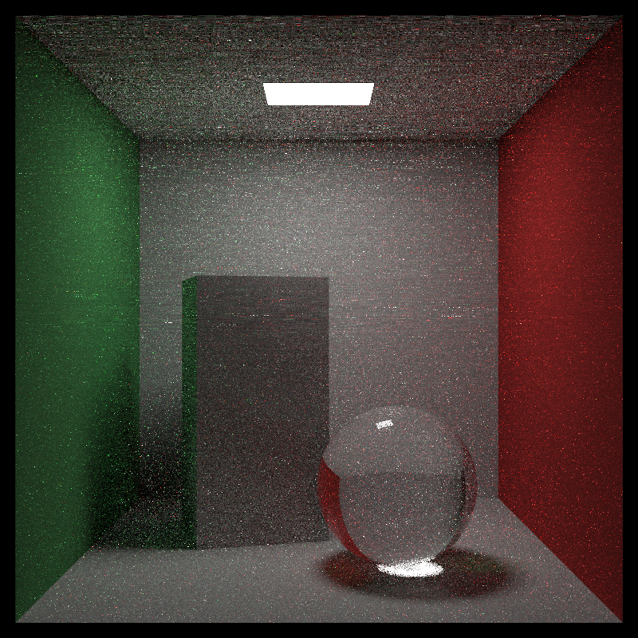
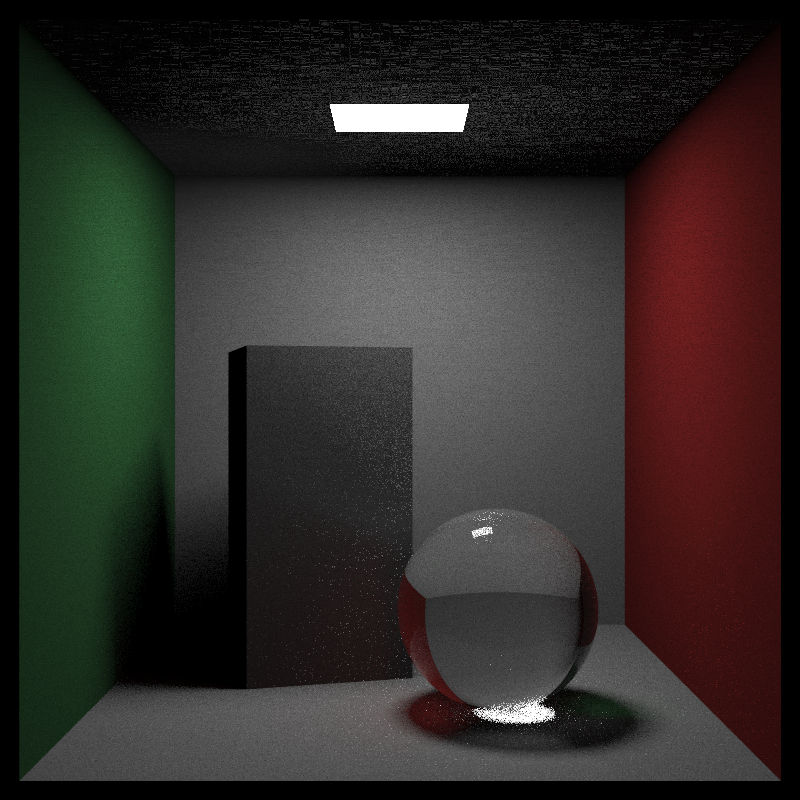

# Simple Ray Tracer
Based on [_Ray Tracing in One Weekend_](https://raytracing.github.io/books/RayTracingInOneWeekend.html). Try to learn raytracing fast.

Replacing each component referencing to book  [Physically Based Rendering](http://www.pbr-book.org/). Also some code from [pbrt-v3](https://github.com/mmp/pbrt-v3). 

### 性能对比

目标图片参数：

```C++
int spp=100;
constexpr auto aspect_ratio = 3.0 / 2.0;
constexpr int image_width = 1200;
```

2560$\times$1600  600spp示例图像



CPU:10710U 35W

| BOX      | 线程 | 时间    |
| -------- | ---- | ------- |
| NO       | 10   | 305.57s |
| Only Box | 10   | 501.3s  |
| BVH      | 10   | 45.77s  |

加速效果明显。关于时间复杂度的分析待完成。

### 添加一些元素


### 重要性采样

基于[_Ray Tracing: The Rest of Your Life_](https://raytracing.github.io/books/RayTracingTheRestOfYourLife.html)。感谢教程作者的工作。

64spp，对灯和球进行重要性采样

#### 完全lambertian



#### 0.5*Importance Sampling



#### 0.8*Importance Sampling



#### 1.0*Importance Sampling



### 下一步计划

- [x] 重构代码，使扩展性更强。


- [ ] CPU矢量化支持。


- [ ] CUDA支持。
- [x] Spectrum rendering
- [ ] Stokes矢量和Muller矩阵
- [ ] Volume Rendering and atmosphere 